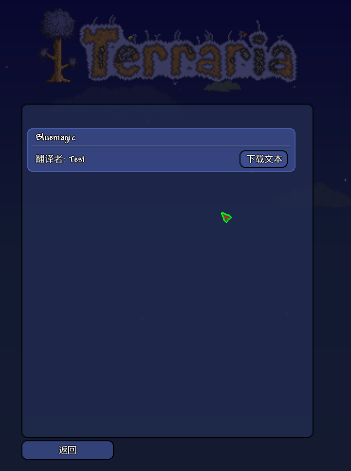
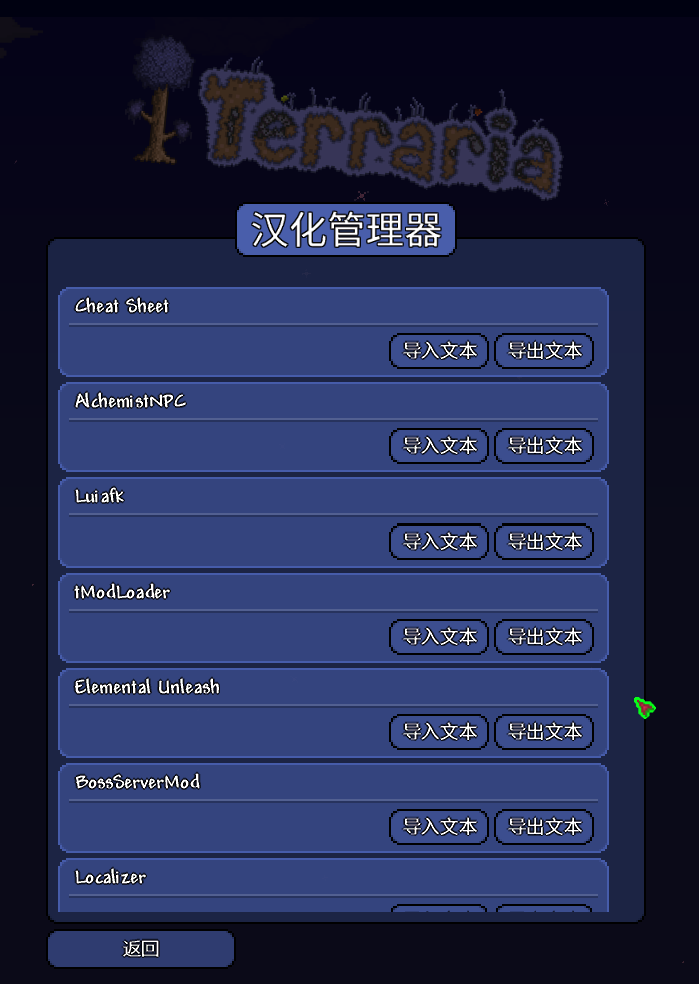

本着开源精神，我做了这个mod，它能够从在线的文本库下载文本并用来汉化你安装的其他mod，相比起传统的汉化方式，对汉化者和使用者都更加方便。同时，本mod没有限制，任何人都可以使用，**源代码及文本都在github上开源**，公开透明。

## 该Mod特点
---
1. 无需修改原mod即可实现汉化。  

>如果用传统方式，当一个mod更新之后，汉化者需要花费时间去更新，还得重新提取修改导入上传，十分不便。  
>而使用新方式，只需要将mod更新至新版即可，旧文本依然可以使用在新版mod上，也不需要下原版汉化两个版本的mod，简洁方便。  

2. 文本开源。  

>传统方式，一个mod的汉化不便于合作，而开源的文本任何人都有机会作贡献，即使原汉化者摸了，想接手的人也能直接接盘。  

3. 自动更新。  

>mod会自动获取在线文本库的信息，如果一个文本有更新就会自动下载，无需重新下一遍整个mod，对于汉化者而言好处就是做点小修改也可以随意，不用担心麻烦。
## 参与
---

但是目前基本没有文本，所以希望更多人能够参与进来，服务大众。如果你想参与翻译，可以加这个qq群:643386249，这是我的个人群，由于没什么卵用就拿来当作汉化群用算了。如果只是想用汉化就没必要加了，到时候会在各种地方发布的，不用担心弄不到。

Mod目前还处于开发中的阶段，基本功能完成度大概60%~70%。如果想帮忙开发，项目地址是https://github.com/AxeelAnder/LocalizerMod 。欢迎任何pr。

---

如果有精力我应该会实现一套补丁系统，有了这个系统，就能够汉化任何地方的文本，而且也不需要修改mod。

同时补丁系统还能够用来修复别的mod的bug。  

## 截图
---

【主菜单】点击汉化即可进入汉化菜单界面  
  
【菜单】  
  
【浏览器】可以浏览在线文本库并且下载想要的文本  

【管理器】其实叫管理器不太妥，之后会改名，这个是给汉化者用的，可以导入导出任意mod的文本  
  
【下载管理】可以查看文本下载的进度，因为文本体积比较小都是直接0到100了  
  

【汉化效果展示】  
  
  
  

---

大概就这样，结尾照例宣传boss服，点击链接加入群聊[泰拉瑞亚Boss服务器](https://jq.qq.com/?_wv=1027&k=5MDBxBB)， 或者群号333438229。